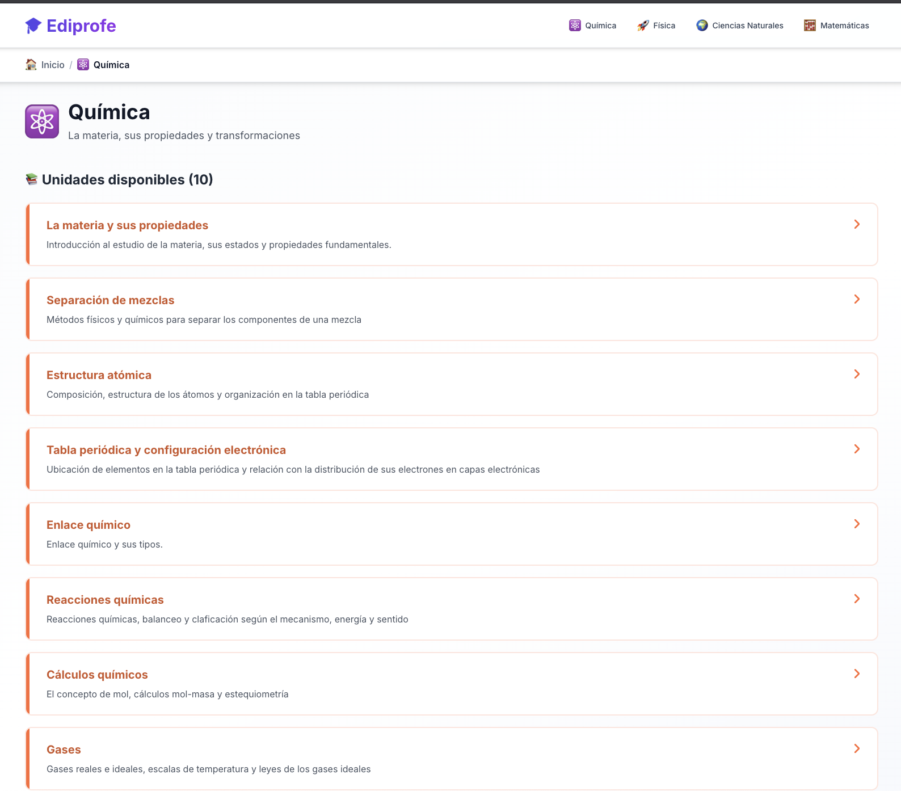
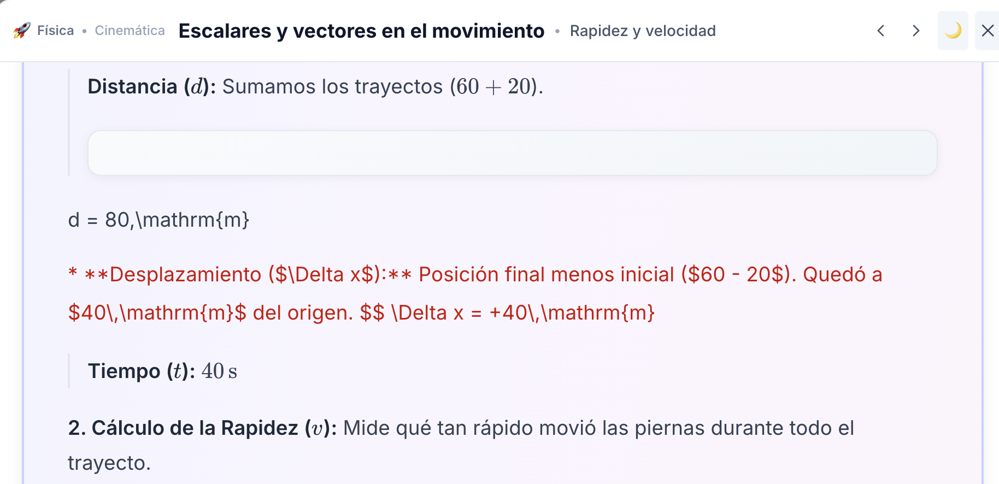
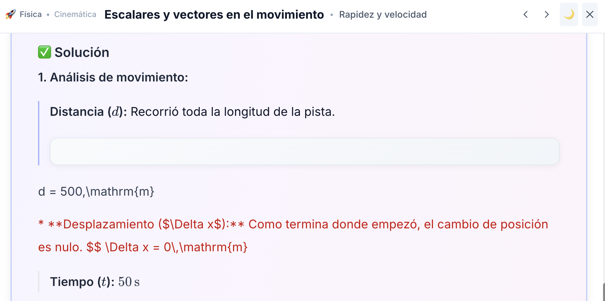
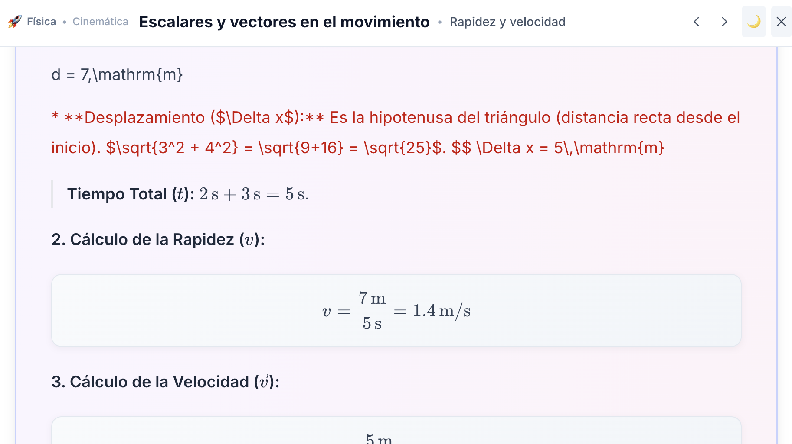
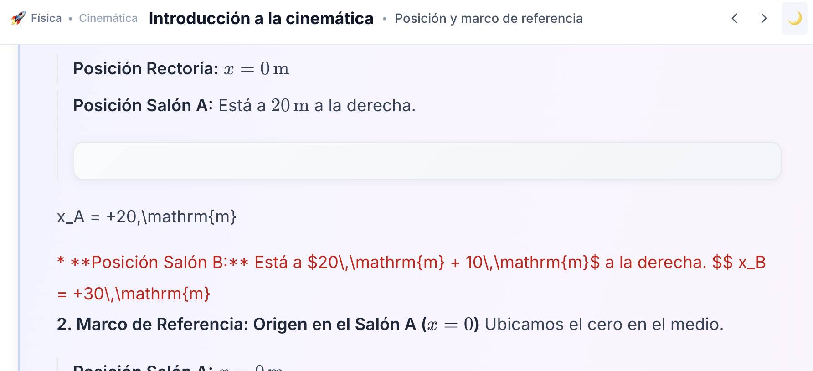
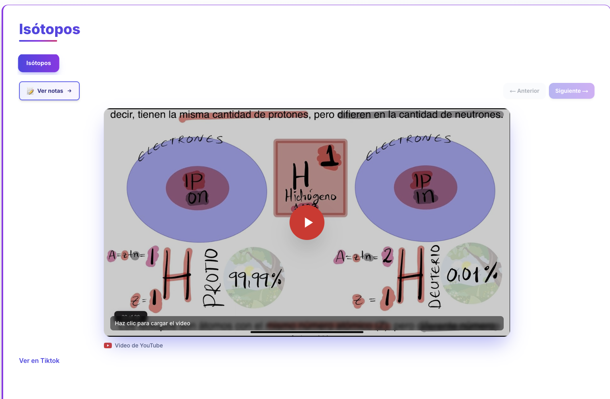
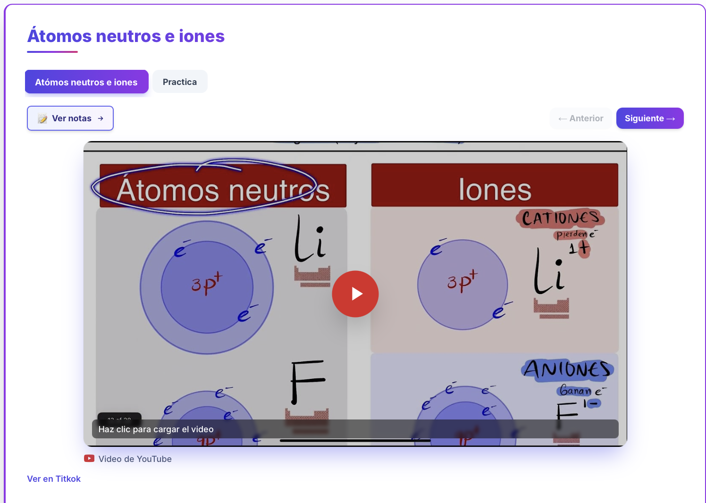
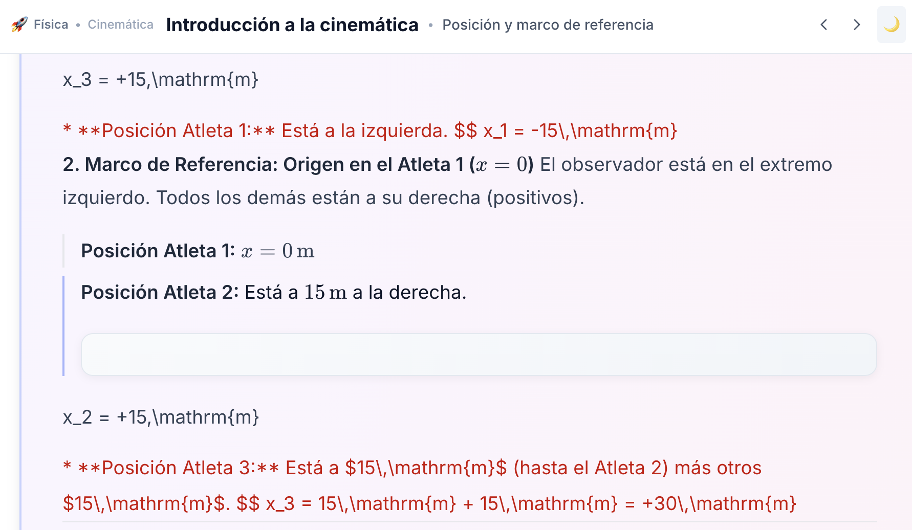

En cada foto verás el error en el renderizado de ecuaciones latex bien sea en tablas, o en bloque o inline. Necesito que mires cada imagen y por favor hagas esté código más robusto para que sea cual sea la expresión de latex que se mande, esta se renderice sin errores.

Lee el código, analízalo profundamente y por favor arregla para que ese renderizado de latex y markdown sea robusto e inteligente. Mantén las buenas prácticas.